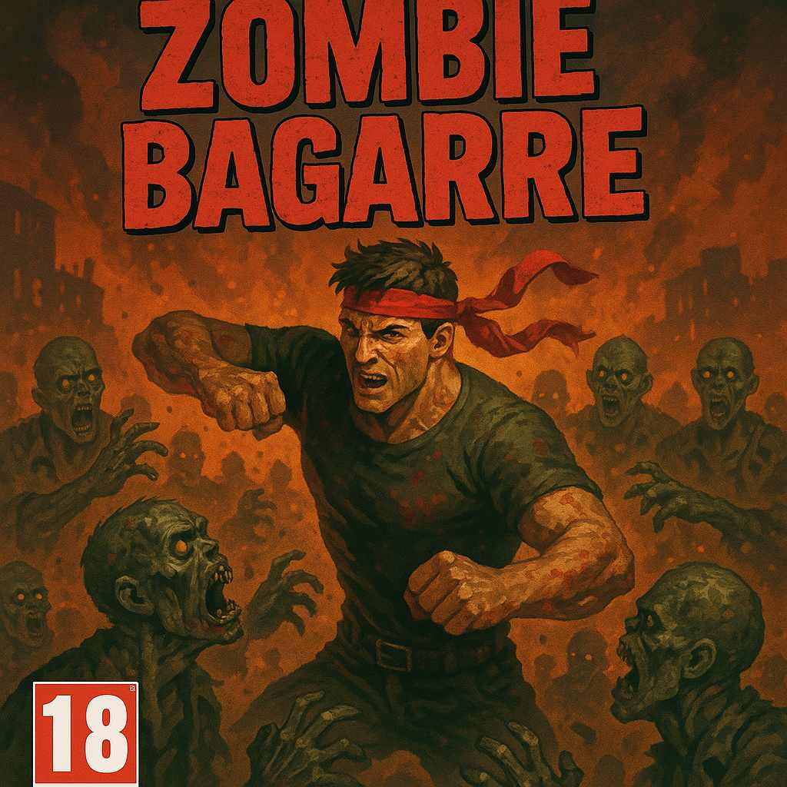
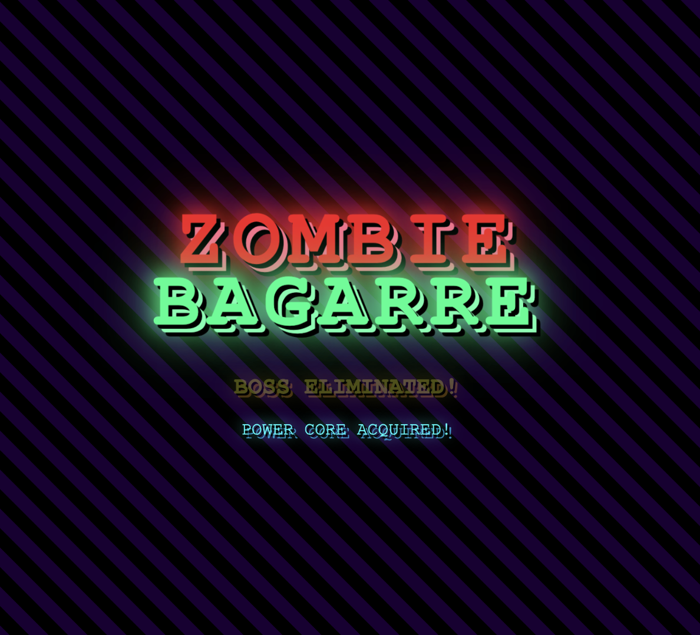
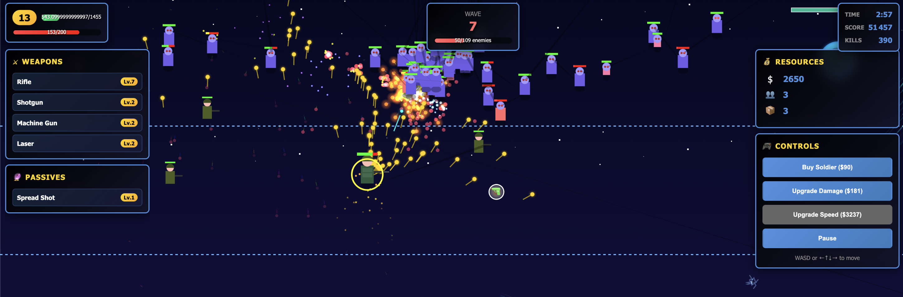
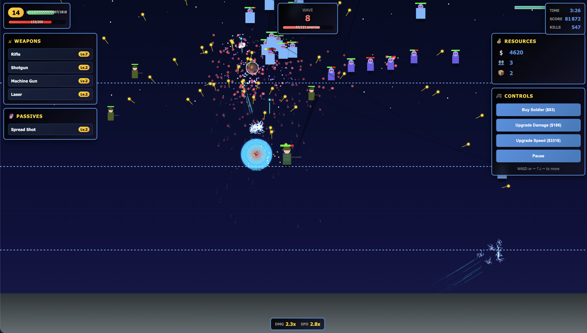
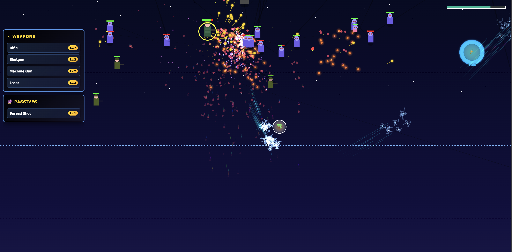
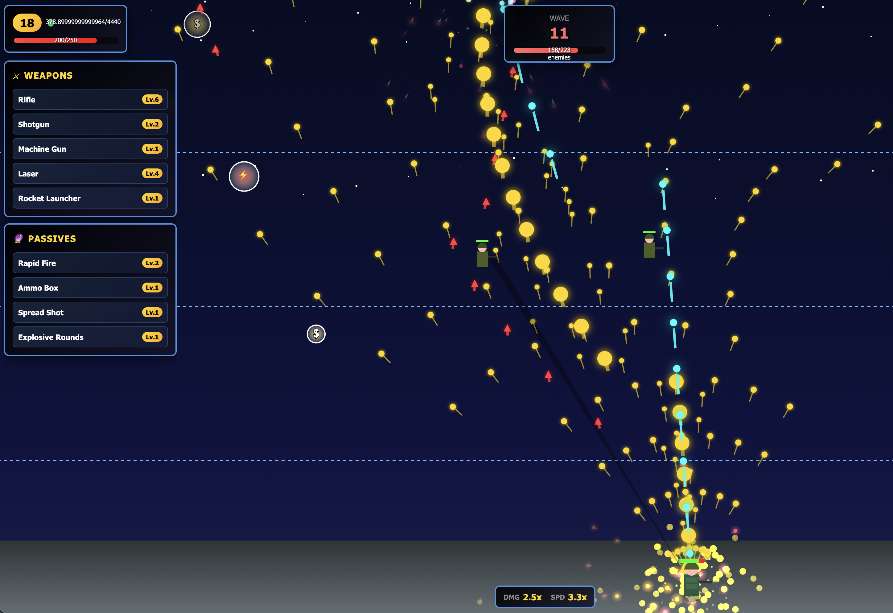
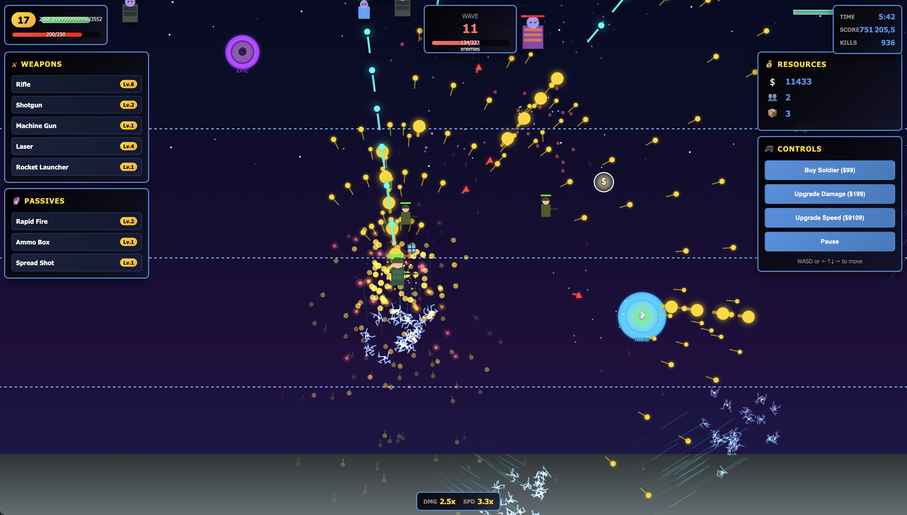

# 🧟‍♂️ ZOMBIE BAGARRE

<div align="center">



**🎮 An intense HTML5 zombie survival game with extreme difficulty and stunning visual effects**

[](https://github.com/hostin/jeudelapub/stargazers)
[](https://github.com/hostin/jeudelapub/network)
[](https://github.com/hostin/jeudelapub/issues)
[](LICENSE)

[](https://developer.mozilla.org/en-US/docs/Web/HTML)
[](https://developer.mozilla.org/en-US/docs/Web/CSS)
[](https://developer.mozilla.org/en-US/docs/Web/JavaScript)
[](https://developer.mozilla.org/en-US/docs/Web/API/Canvas_API)

[🎮 **PLAY NOW**](https://hostin.github.io/jeudelapub/) | [📸 **SCREENSHOTS**](#screenshots) | [🚀 **FEATURES**](#features) | [⚡ **QUICK START**](#quick-start)

</div>

---

## 📖 About

**Zombie Bagarre** is an intense, fast-paced zombie survival game that pushes your skills to the limit! Built with pure HTML5, CSS3, and JavaScript, this browser-based apocalypse simulator features **extreme difficulty**, **overwhelming hordes**, and **spectacular visual effects**.

Survive increasingly brutal waves of the undead, unlock powerful weapons, master devastating special abilities, and face epic boss encounters in this ultimate test of survival gaming!

---

## 🖼️ Screenshots

<div align="center">

### 🎮 Gameplay Screenshots










</div>

---

## ⚡ Features

### 🔥 **EXTREME DIFFICULTY**
- **Massive Hordes**: Face 50-200+ zombies per wave with exponential scaling
- **Brutal Enemies**: All zombies deal 2x damage and have 200%+ health
- **Lightning Fast**: Enemies move 50%+ faster for relentless pressure
- **Resource Scarcity**: Start with minimal money and reduced damage
- **Short Range**: Weapons have limited range - positioning is critical!

### ⚔️ **Advanced Combat System**
- **15+ Unique Weapons**: From pistols to the legendary Phieraggi
- **Weapon Evolution**: Combine max-level weapons with passive items
- **Level-Based Scaling**: Weapons get progressively more powerful
- **Subtle Muzzle Effects**: Refined particle effects that don't overwhelm
- **Smart Auto-Targeting**: Intelligent enemy prioritization

### 👹 **20 Enemy Types**
- **10 Monster Varieties**: Crawlers, Brutes, Spitters, Phase Walkers, and more
- **10 Epic Bosses**: Each with 500-1000x health and devastating attacks
- **Special Abilities**: Phasing, healing, summoning, stealth, and explosions
- **Intelligent AI**: Advanced pathfinding and tactical behavior
- **Progressive Scaling**: Enemies become exponentially stronger each wave

### 🎨 **Stunning Visual Effects**
- **Weapon-Specific Muzzle Flashes**: Every weapon has unique effects
- **Advanced Particle System**: 7+ particle types with physics simulation
- **Epic Boss Encounters**: Screen-shaking battles with special effects
- **Loot Rarity System**: Common, Rare, Epic, and Legendary drops
- **Smooth 60fps**: Optimized rendering even with hundreds of entities

### 📈 **Deep Progression**
- **Passive Item System**: 10+ upgrades that stack and combine
- **Meta Progression**: Persistent character unlocks and stats
- **Special Boss Drops**: Unique items from each boss type
- **Weapon Mastery**: Level weapons from 1-8 for maximum power
- **Strategic Choices**: Multiple viable upgrade paths

---

## 🎮 Controls

| Action | Key/Control |
|--------|------------|
| **Move** | `WASD` or `Arrow Keys` |
| **Shoot** | Automatic targeting |
| **Pause** | `P` or Pause button |
| **Start Game** | `Enter` on splash screen |
| **Mobile** | Touch controls & virtual joystick |

---

## 🚀 Quick Start

### 🌐 Play Online
```
🎮 Just click and play: https://hostin.github.io/jeudelapub/
```

### 💻 Local Development
```bash
# Clone the repository
git clone https://github.com/hostin/jeudelapub.git

# Navigate to project
cd jeudelapub

# Open in browser
open index.html
```

### 🔧 No Build Process Required!
- Pure HTML5/CSS3/JavaScript
- No dependencies or frameworks
- Works in any modern browser
- Mobile-optimized responsive design

---

## 🛠️ Technical Highlights

<div align="center">

| Technology | Usage |
|------------|-------|
| **HTML5 Canvas** | High-performance 2D rendering |
| **ES6+ JavaScript** | Modern async/await, classes, modules |
| **CSS3 Animations** | Smooth UI transitions and effects |
| **Local Storage** | Persistent save system |
| **Mobile APIs** | Touch controls and responsive design |

</div>

### 🔥 Performance Features
- **Object Pooling**: Efficient memory management for bullets/particles
- **Culling System**: Only render visible entities
- **Optimized Collision**: Spatial partitioning for performance
- **Smart Particle Limits**: Dynamic quality scaling
- **60fps Target**: Consistent frame rate even in massive battles

---

## 📁 Project Structure

```
jeudelapub/
├── 📄 index.html          # Game HTML structure
├── 🎮 game.js            # Core game engine (6500+ lines)
├── 🎨 style.css          # UI styling and animations
├── 📸 img/               # Screenshots and artwork
│   ├── 🖼️ artwork.jpg    # Splash screen background
│   ├── 📷 screenshot*.png # Gameplay screenshots
└── 📋 README.md          # This documentation
```

---

## 🎯 Game Mechanics Deep Dive

### ⚔️ **Weapon Evolution System**
```
Base Weapon + Passive Item = Evolved Weapon

Examples:
Rifle + Ammo Box = Plasma Rifle
Flamethrower + Spread Shot = Dragon Breath
Laser + Energy Core = Gatling Laser
```

### 👹 **Boss Progression**
| Wave | Boss | Special Ability | Health Multiplier |
|------|------|----------------|-------------------|
| 5 | Horde King | Summons minions | 50x |
| 10 | Iron Colossus | Heavy armor | 80x |
| 15 | Plague Mother | Poison clouds | 120x |
| 20 | Shadow Reaper | Teleportation | 160x |
| 25+ | ... | Various | 220x-1000x |

### 🎮 **Difficulty Scaling**
- **Wave 1**: 50 zombies, 180 health each
- **Wave 10**: 300 zombies, 470 health each
- **Wave 20**: 650 zombies, 820 health each
- **Wave 30+**: 1000+ zombies, 1200+ health each

---

## 🏆 Achievements & Stats

Track your apocalypse survival with detailed statistics:

- 🏅 **Highest Wave Reached**
- ⏱️ **Total Survival Time**
- 💀 **Zombie Kill Count**
- 🔫 **Weapons Evolved**
- 💰 **Money Earned**
- 🎯 **Accuracy Rating**

---

## 🤝 Contributing

We welcome contributions! Here's how you can help:

### 🐛 Report Issues
- Use GitHub Issues for bug reports
- Include screenshots and reproduction steps
- Specify browser and device info

### 💡 Feature Requests
- Suggest new weapons or enemies
- Propose gameplay improvements
- Share balancing feedback

### 🔧 Code Contributions
```bash
1. Fork the repository
2. Create a feature branch
3. Make your changes
4. Test thoroughly
5. Submit a pull request
```

---

## 📜 License

This project is open source under the **MIT License**.

```
Permission is hereby granted, free of charge, to any person obtaining a copy
of this software to deal in the Software without restriction, including
without limitation the rights to use, copy, modify, merge, publish,
distribute, sublicense, and/or sell copies of the Software.
```

---

## 🌟 Support the Project

If you enjoy Zombie Bagarre, consider:

⭐ **Starring** the repository
🍴 **Forking** to create your own version
🐛 **Reporting bugs** to help improve the game
💡 **Suggesting features** for future updates
📢 **Sharing** with friends who love zombie games!

---

<div align="center">

### 🧟‍♂️ Ready to Face the Apocalypse?

[](https://hostin.github.io/jeudelapub/)

**Made with ❤️ and lots of ☕ by [VibeCoding](https://github.com/hostin)**

*"In the zombie apocalypse, only the strongest survive... Can you?"*

---


</div>